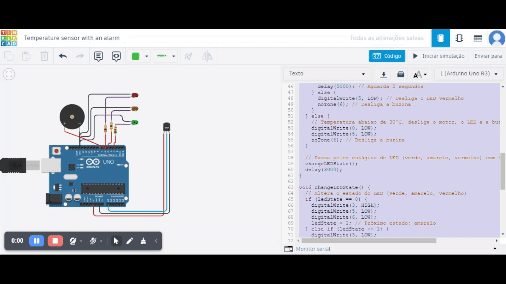
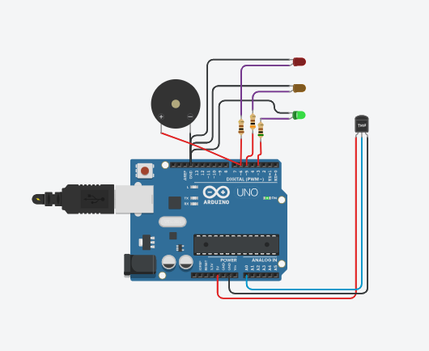
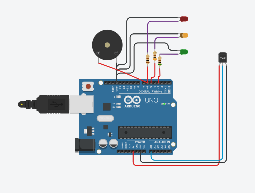
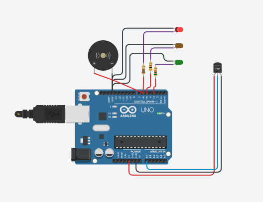

# Report on Arduino Temperature Control Project with Visual and Auditory Alert

## Introduction:

The aim of the project is to create a temperature control system using an Arduino board, temperature sensor, fan motor, LEDs, and a buzzer. The goal is to monitor ambient temperature and activate the fan when the temperature exceeds a certain threshold, while also providing visual and auditory alerts in emergency situations.

## Methods:

The code was developed in the Arduino programming language, based on C/C++. The temperature sensor is connected to analog pin A0, the fan motor to digital pin 0, LEDs to digital pins 3, 5, and 6, and the buzzer to digital pin 6. The code utilizes specific Arduino functions for sensor reading, control of output pins, and tone generation on the buzzer.

The system is designed to activate the fan when the temperature exceeds 30°C, and in case of an emergency (temperature above 50°C), trigger an auditory alert along with a red LED.

## Results:

The system was successfully implemented, and during testing, it was observed that the fan motor is activated when the temperature exceeds the defined limit. In emergency situations, the red LED is activated along with the buzzer, providing a visual and auditory alert.

## Conclusion:

The project demonstrated the effectiveness of temperature control using an Arduino microcontroller. The system is versatile and can be adapted for different environments where temperature monitoring is crucial. The integration of visual and auditory alerts enhances the system's effectiveness, especially in emergency situations.

## Case Study: Temperature Control System in a Server Room:

Imagine a scenario where the project is implemented in a server room. The temperature sensor is strategically positioned to monitor environmental conditions. When the temperature exceeds 30°C, the fan is activated to maintain the room within safe limits. In extreme cases, such as failures in the cooling system, the visual and auditory alert is triggered, indicating a critical situation that requires immediate attention to prevent damage to sensitive equipment.

This case study highlights the applicability of the project in critical environments where precise temperature control is vital for the stable operation of heat-sensitive equipment.

## References:

- Official Arduino Documentation: [https://www.arduino.cc/](https://www.arduino.cc/)

This report underscores the success of the Arduino Temperature Control project, providing a practical and effective solution for monitoring and control in specific environments.
